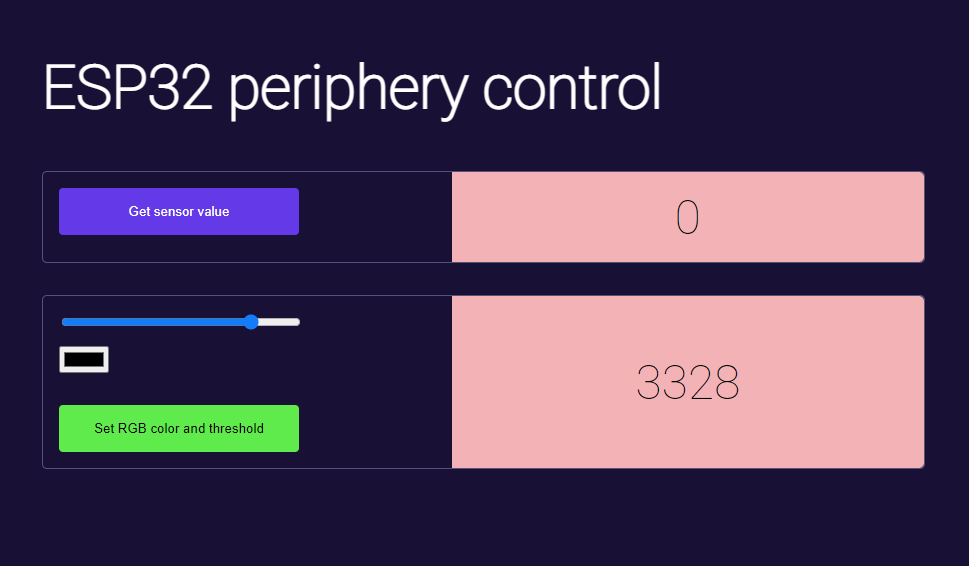

# esp32-REST_API

Web Interface for ESP32 control:

Hardware wiring:

Instructions/issues:

0. Add esp32 to Arduino IDE: https://dl.espressif.com/dl/package_esp32_index.json
1. Install (as Admin!) usb-uart driver (CP210x_VCP_Windows.zip).
2. On uploading code hold BOOT button on ESP.
3. After upload reconnect USB.

Follow these steps:

